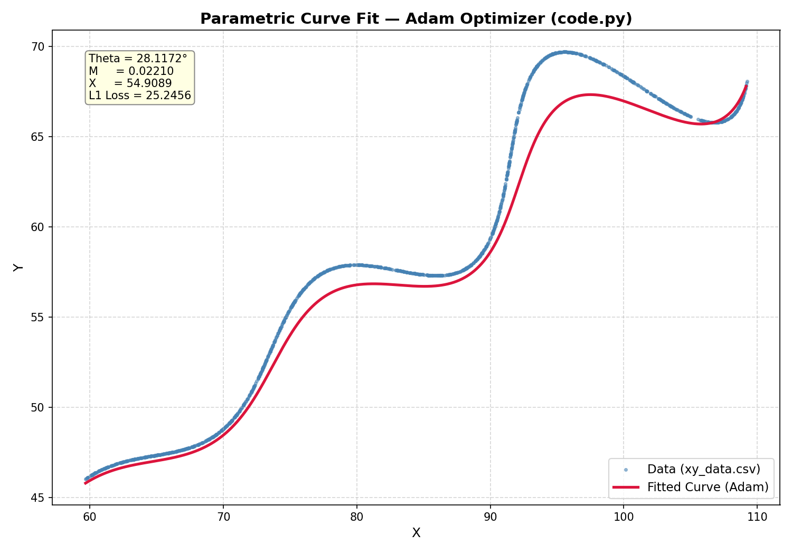
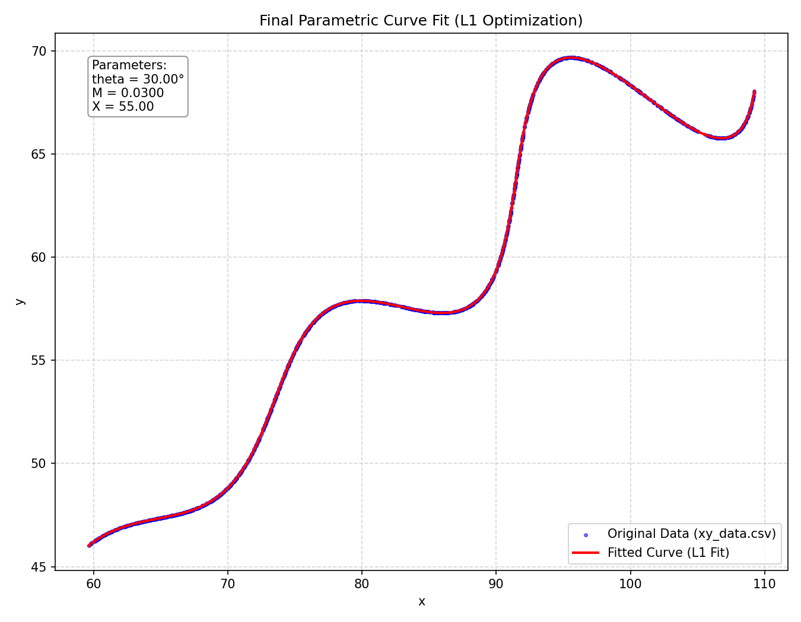

# Parametric Curve Optimization Using PyTorch Gradient-Based Optimization

## Problem Statement

Solve for missing parameters, $\theta$, $M$ and $X$ in a parametric curve equation:

$$x(t) = t \cdot \cos(\theta) - e^{M|t|} \cdot \sin(0.3t) \cdot \sin(\theta) + X$$
$$y(t) = 42 + t \cdot \sin(\theta) + e^{M|t|} \cdot \sin(0.3t) \cdot \cos(\theta)$$

Assume that we have 1500 data values for $t$ in the interval [6, 60] and given parameters such that:

- $0^\circ < \theta < 50^\circ$
- $-0.05 < M < 0.05$
- $0 < X < 100$

In other words, they gave us the points (x, y) lying on a curve for 6 < t < 60 and we need to determine three unknowns in the curve and sketch it.

## Final Solution

$$\left(t\cos(0.523599) - e^{0.030000\left|t\right|}\sin(0.3t)\sin(0.523599) + 55.000000, 42 + t\sin(0.523599) + e^{0.030000\left|t\right|}\sin(0.3t)\cos(0.523599)\right)$$

**Optimized Parameters:**

- $\theta = 30.000000^\circ$ ~ approximately ($0.523599$ radians)
- $M = 0.030000$
- $X = 55.000000$
- **Real L1 Distance** = $0.00000316$ (Mean L1 coordinate distance)

---

## Core Idea: Equations as Neurons

The main idea of this project is to use a deep learning framework (PyTorch) for numerical optimization. The parametric equations of the curve are used as our model architecture, rather than the standard layers of a neural network. The unknown variables ( $\theta, M, X$ ) are called trainable weights and they are optimized by means of the gradient descent and quasi-Newton optimization algorithms.

---

## The First Approach (`code.py`)

The first model in code.py would try to solve the equations directly:

We set $\theta$, $M$ and $X as parameters.
To approximate the curve we created a uniform set of t values with linspace(6, 60).
We optimized the parameters with the `Adam` optimizer to minimize the L1 distance, as follows: 3.

Limitation: This method produced an L1 loss of ~25.0. The optimizer was caught in a bad local minimum because we assumed that the $t$ values that are represented in the CSV were uniformly spaced and aligned, which is not true.

The following is a fit visualisation from this first approach. The curve that is expected can be seen is misaligned, and is stuck in a local minimum:

---

## The Mathematical Solution: De-Rotating the Curve

To solve the alignment issue of $t$, we analyzed the geometry of the curve equations.

### 1. Geometry of the Curve
Look at the given parametric equations:
$$x = t \cos\theta - e^{M|t|} \sin(0.3t) \sin\theta + X$$
$$y = 42 + t \sin\theta + e^{M|t|} \sin(0.3t) \cos\theta$$

Subtracting the offsets ($X$ and $42$) centers the curve at the origin:
$$x - X = t \cos\theta - e^{M|t|} \sin(0.3t) \sin\theta$$
$$y - 42 = t \sin\theta + e^{M|t|} \sin(0.3t) \cos\theta$$

Now, we replace the complicated exponential/sine term with a simple variable $A$:
$$A = e^{M|t|} \sin(0.3t)$$

This simplifies the equations to:
$$x - X = t \cos\theta - A \sin\theta$$
$$y - 42 = t \sin\theta + A \cos\theta$$

### 2. Identifying the Rotation Matrix
This pattern perfectly matches the standard 2D rotation equations. 
When any coordinate $(a, b)$ is rotated by an angle $\theta$, the rotated coordinates $(x', y')$ are given by:
$$x' = a \cos\theta - b \sin\theta$$
$$y' = a \sin\theta + b \cos\theta$$

By comparing the two sets of equations:
- $a = t$
- $b = A = e^{M|t|} \sin(0.3t)$

This reveals that the original coordinate before rotation was $(t, A)$!

The system can be written in matrix form as:
$$\begin{bmatrix} x - X \\ y - 42 \end{bmatrix} = \begin{bmatrix} \cos\theta & -\sin\theta \\ \sin\theta & \cos\theta \end{bmatrix} \begin{bmatrix} t \\ A \end{bmatrix}$$

The matrix below is a standard rotation matrix:
$$\begin{bmatrix} \cos\theta & -\sin\theta \\ \sin\theta & \cos\theta \end{bmatrix}$$

### 3. Reverse Rotation (De-Rotation)
To map each individual point in `xy_data.csv` to its correct value of $t$, we can apply the inverse rotation (rotating by $-\theta$). The inverse rotation matrix is:
$$\begin{bmatrix} t \\ z_{actual} \end{bmatrix} = \begin{bmatrix} \cos\theta & \sin\theta \\ -\sin\theta & \cos\theta \end{bmatrix} \begin{bmatrix} x - X \\ y - 42 \end{bmatrix}$$

This simplifies to:
$$t = (x - X)\cos\theta + (y - 42)\sin\theta$$
$$z_{actual} = -(x - X)\sin\theta + (y - 42)\cos\theta$$

Using this method, the exact parameter $t$ for each individual coordinate $(x, y)$ in the CSV is dynamically calculated. We then compare our model $z_{model} = e^{M|t|} \sin(0.3t)$ against $z_{actual}$.

---

## Second Approach: L-BFGS & Bounded Constraints (`optimize.py`)

Using this mathematical rotation trick, we implemented `optimize.py` with the following enhancements:

1. **L-BFGS Optimizer**: We used PyTorch's L-BFGS optimizer to quickly find the minimum.
2. **Bounds Clamping inside Closure**: Since L-BFGS performs line searches and evaluates the closure multiple times per step, we moved parameter clamping inside the `closure()` loop. This prevents parameters from stepping out of bounds during intermediate optimization steps.
3. **Loss Computation**: We optimize in the rotated 1D space, and then output the true 2D L1 loss ($|x_{pred}-x_{csv}| + |y_{pred}-y_{csv}|$) at the end.

This approach successfully avoids local minima, converging to:

- **$\theta$ (Theta)**: $30.0000^\circ$ (which is $\frac{\pi}{6}$ radians)
- **$M$**: $0.03000$
- **$X$**: $55.0000$
- **Real L1 Loss**: **$0.00000316$** (effectively $0$)

Here is the final optimized curve fit plotted against the raw data points showing perfect convergence:

